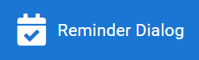

[![Contributors][contributors-shield]][contributors-url]
[![Forks][forks-shield]][forks-url]
[![Stargazers][stars-shield]][stars-url]
[![Issues][issues-shield]][issues-url]
[![MIT License][license-shield]][license-url]


<!-- PROJECT LOGO -->
<br />
<p align="center">
   

   <h3 align="center">Reminder Dialog Component</h3>

   This is a component demonstrating a reminder scheduler.  It supports RRule for recurring events.
   <br />
   <a href="https://34fame.github.io/q-reminder-dialog">View Demo</a>
</p>


<!-- TABLE OF CONTENTS -->
## Table of Contents

* [About the Project](#about-the-project)
  * [Built With](#built-with)
* [Getting Started](#getting-started)
  * [Prerequisites](#prerequisites)
  * [Installation](#installation)
* [Usage](#basic-usage)
* [Roadmap](#roadmap)
* [Contributing](#contributing)
* [License](#license)
* [Contact](#contact)
* [Acknowledgements](#acknowledgements)


<!-- ABOUT THE PROJECT -->
## About The Project

[![Product Name Screen Shot][product-screenshot]](https://example.com)

This is a component created with Quasar Framework components.  It demonstrates interesting use cases for Quasar's
 components but, more importantly, it creates RRule compliant output for generating recurring events.
 
I wrote a Medium article related to this titled ['Add Recurring Rules for Calendar Dates to your Application'](https://levelup.gitconnected.com/add-recurring-rules-for-calendar-dates-to-your-application-401e39b56b2f)

### Built With

- [Vue.js](https://vuejs.org)
- [Quasar Framework](https://quasar.dev)
- [Moment.js](https://momentjs.com)
- [rrule.js](https://www.npmjs.com/package/rrule)

<!-- GETTING STARTED -->
## Getting Started

### Prerequisites

- [Quasar Framework](https://quasar.dev)
   ```sh
   npm install quasar -g
   yarn global add quasar
   ```

### Installation

- Clone the repo
   ```sh
   git clone https://github.com/34fame/q-reminder-dialog.git
   ```

- Install NPM packages
   ```sh
   cd q-reminder-dialog
   yarn
   ```
- Run locally
   ```sh
   quasar dev
   ```

<!-- USAGE EXAMPLES -->
## Basic Usage

- Mimic reminder creation events
- Supports simple to complex schedules
   - One-time reminder
   - Recurring reminders
      - Hourly, Daily, Weekly, Monthly, Annually
   - Intervals (e.g. every day, every other day, every 3 days...)
   - By Week Days (only on selected days)
   - By Months (only on selected months)
   - By Days of Month (e.g. 1st and 15th days of month)
   - By Days of Year (e.g. 1st - 365th day of year)
   - By Position (e.g. Combine with Monthly on Wednesdays.  A value of 4 would mean only the 4th Wednesday of every
    month.)
   - By Hours (only at these hours 0-23)
   - By Minutes (only at these minutes 0-59)
- Demonstrates some interesting uses of Quasar Framework components
   - QInput, QSelect, QDatePicker, QTimePicker


<!-- CONTACT -->
## Contact

Troy Moreland - Graypes#3890 - Discord

Project Link: [https://github.com/34fame/q-reminder-dialog](https://github.com/34fame/q-reminder-dialog)

<!-- ACKNOWLEDGEMENTS -->
## Acknowledgements

* [Razvan Stoenescu](https://github.com/sponsors/rstoenescu) - Quasar Framework Author
* [Jeff Galbraith](https://github.com/sponsors/hawkeye64) - Quasar Framework Developer

<!-- MARKDOWN LINKS & IMAGES -->
<!-- https://www.markdownguide.org/basic-syntax/#reference-style-links -->
[contributors-shield]: https://img.shields.io/github/contributors/34fame/q-reminder-dialog
[contributors-url]: https://github.com/34fame/q-reminder-dialog/graphs/contributors
[forks-shield]: https://img.shields.io/github/forks/34fame/q-reminder-dialog
[forks-url]: https://github.com/34fame/q-reminder-dialog/network/members
[stars-shield]: https://img.shields.io/github/stars/34fame/q-reminder-dialog
[stars-url]: https://github.com/34fame/q-reminder-dialog/stargazers
[issues-shield]: https://img.shields.io/github/issues/34fame/q-reminder-dialog
[issues-url]: https://github.com/34fame/q-reminder-dialog/issues
[license-shield]: https://img.shields.io/github/license/34fame/q-reminder-dialog
[license-url]: https://github.com/34fame/q-reminder-dialog/blob/master/LICENSE.txt
[product-screenshot]: ./screenshot.png
